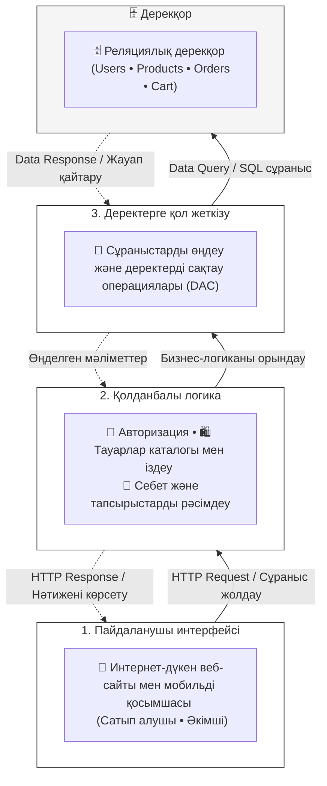

# Интернет-дүкен ақпараттық жүйесінің үш деңгейлі архитектурасы

```mermaid
graph TD
    %% Стили для красивого отображения (как в методичке)
    classDef layerStyle fill:#ffffff,stroke:#cccccc,stroke-width:1px,rx:5px,ry:5px;
    classDef dbStyle fill:#f5f5f5,stroke:#cccccc,stroke-width:1px,rx:5px,ry:5px;

    %% 1. Презентация деңгейі
    subgraph Layer1 [1. Пайдаланушы интерфейсі]
        UI_Desc["🛒 Интернет-дүкен веб-сайты мен мобильді қосымшасы <br> (Сатып алушы • Әкімші)"]
    end
    style Layer1 fill:#ffffff,stroke:#333333,stroke-width:1px;

    %% 2. Қолданбалы логика деңгейі
    subgraph Layer2 [2. Қолданбалы логика]
        Logic_Desc["🔐 Авторизация • 🛍️ Тауарлар каталогы мен іздеу <br> 🛒 Себет және тапсырыстарды рәсімдеу"]
    end
    style Layer2 fill:#ffffff,stroke:#333333,stroke-width:1px;

    %% 3. Деректерге қол жеткізу деңгейі
    subgraph Layer3 [3. Деректерге қол жеткізу]
        DAC_Desc["🔄 Сұраныстарды өңдеу және деректерді сақтау операциялары (DAC)"]
    end
    style Layer3 fill:#ffffff,stroke:#333333,stroke-width:1px;

    %% 4. Дерекқор деңгейі
    subgraph Layer4 [🗄️ Дерекқор]
        DB_Desc["🗄️ Реляциялық дерекқор <br> (Users • Products • Orders • Cart)"]
    end
    style Layer4 fill:#f5f5f5,stroke:#333333,stroke-width:1px;

    %% Прямой поток данных (Сверху вниз)
    Layer1 -->|HTTP Request / Сұраныс жолдау| Layer2
    Layer2 -->|Бизнес-логиканы орындау| Layer3
    Layer3 -->|Data Query / SQL сұраныс| Layer4

    %% Обратный поток данных (Снизу вверх)
    Layer4 -.->|Data Response / Жауап қайтару| Layer3
    Layer3 -.->|Өңделген мәліметтер| Layer2
    Layer2 -.->|HTTP Response / Нәтижені көрсету| Layer1
```

